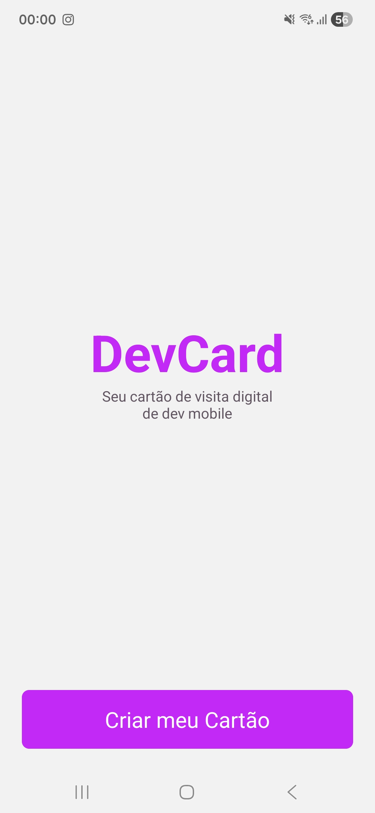
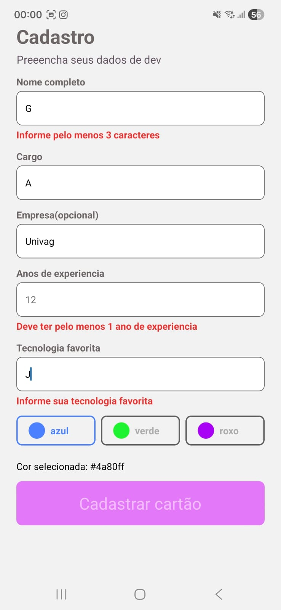
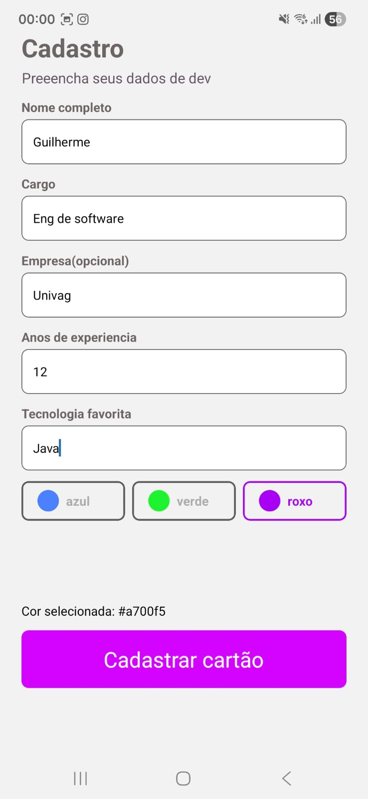
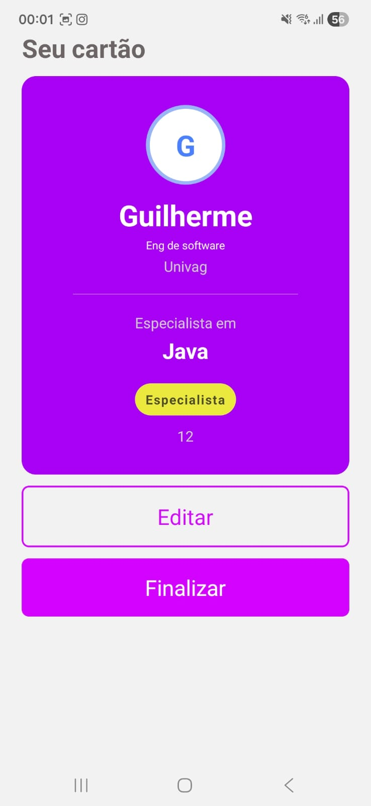
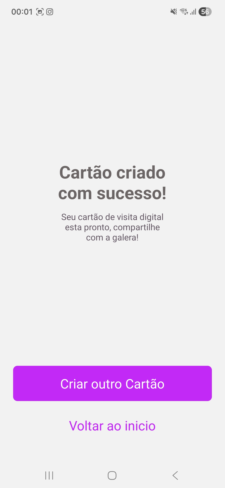

# DevCard

O DevCard é um aplicativo móvel desenvolvido como um cartão de visita digital focado em desenvolvedores mobile. O objetivo principal da aplicação é servir como uma apresentação profissional interativa, permitindo que o usuário gere um cartão estilizado com suas principais informações de carreira. 

Este projeto foi construído para colocar em prática conceitos fundamentais do desenvolvimento mobile moderno, aplicando o uso prático de TypeScript, estilização de layouts com Flexbox, gerenciamento de estado de variáveis, validação de formulários, lógica condicional e navegação entre telas utilizando o Expo Router.

## 📱 Funcionalidades Principais

* **Navegação Estruturada:** O aplicativo possui um fluxo de 4 telas interligadas (Boas-vindas, Cadastro, Preview e Sucesso). O roteamento explora diferentes comportamentos de navegação do Expo Router, utilizando os métodos push, back e replace de acordo com a necessidade de cada etapa do usuário. 
* **Formulário com Validação:** A tela de cadastro conta com campos para inserção de dados profissionais (Nome, Cargo, Empresa, Anos de experiência e Tecnologia favorita), com regras rígidas de validação e controle de estado individual para garantir a consistência das informações. 
* **Geração de Cartão Dinâmico:** Os dados validados são enviados via parâmetros de rota para a tela de Preview, onde um cartão personalizado é renderizado utilizando Flexbox. 
* **Lógica Condicional de Interface:** O layout do cartão se adapta às entradas do usuário. A cor de fundo muda conforme a seleção no formulário, e o sistema calcula automaticamente e exibe uma badge de nível de senioridade (Júnior, Pleno ou Sênior) baseada nos anos de experiência informados.

## 👨‍💻 Autor

**Guilherme Augusto P. de A. e Silva**

---

## 📸 Telas do Aplicativo

  
  
  
  
  

